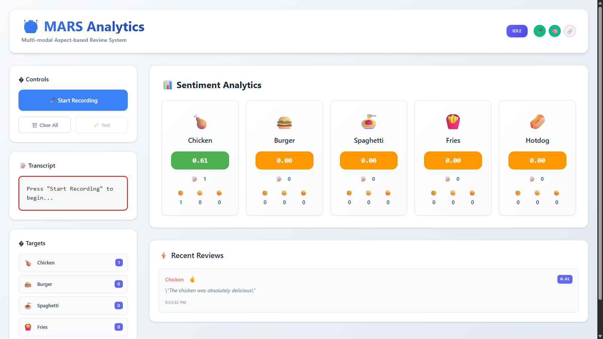

# 🚀 MARS - Multi-modal Aspect-based Review System

A real-time web application for performing aspect-based sentiment analysis on spoken restaurant reviews using cutting-edge web technologies.



## 🧠 System Architecture

### Frontend: React + Chrome Web Speech API + Teachable Machine Audio
- **Web Speech API** (`SpeechRecognition`) for speech-to-text conversion
- **Teachable Machine Audio Model** for keyword detection confidence
- **WebSocket** communication for real-time backend interaction
- **React Dashboard** for live aspect visualization

### Backend: FastAPI + VADER Sentiment Analysis
- **FastAPI** with WebSocket support for real-time communication
- **VADER Sentiment Analyzer** for compound score calculation
- **Modular architecture** with comprehensive error handling

## 🍽️ Target Food Aspects

The system detects exactly these 5 menu items:
- **Chicken**
- **Burger** 
- **Spaghetti**
- **Fries**
- **Hotdog**

## 🤖 Teachable Machine Integration

**Model URL**: https://teachablemachine.withgoogle.com/models/oqK-N66SL/

**Classes**: Background noise, Chicken, Burger, Fries, Hotdog, Spaghetti

The model provides real-time audio classification confidence for each food item, enhancing the speech-to-text keyword detection.

## 🎤 Speech Recognition Configuration

- `continuous = false` - No continuous listening
- `interimResults = false` - Only final results
- `lang = 'en-US'` - English US language
- Manual start/stop control via dashboard buttons
- No auto-restart behavior

## 📊 Sentiment Classification

Uses VADER sentiment analysis with these thresholds:
- **Positive**: compound score ≥ 0.05
- **Negative**: compound score ≤ -0.05  
- **Neutral**: -0.05 < compound score < 0.05

## 🚀 Quick Start

### Prerequisites
- **Node.js** (v16+)
- **Python** (v3.8+)
- **Google Chrome** (for Web Speech API support)

### 1. Backend Setup

```bash
# Navigate to server directory
cd server

# Create virtual environment
python -m venv venv
source venv/bin/activate  # On Windows: venv\Scripts\activate

# Install dependencies
pip install -r requirements.txt

# Start FastAPI server
python main.py
```

The backend will be available at:
- **WebSocket**: `ws://localhost:8000/ws`
- **API Docs**: `http://localhost:8000/docs`
- **Health Check**: `http://localhost:8000/health`

### 2. Frontend Setup

```bash
# Navigate to client directory  
cd client

# Install dependencies
npm install

# Start development server
npm run dev
```

The frontend will be available at: `http://localhost:5173`

## 📱 How to Use

1. **Open the application** in Google Chrome
2. **Check system status** - ensure all indicators show "connected"
3. **Press "Start Recording"** to begin recording
4. **Speak naturally** about the target food items
5. **View real-time results**:
   - Transcript appears immediately
   - Audio classification shows confidence levels
   - Sentiment analysis appears for detected aspects
6. **Press "Stop Recording"** to end the session
7. **Use "Clear All"** to reset the dashboard

## 📁 Project Structure

```
MARS/
│
├── client/                 # React Frontend
│   ├── src/
│   │   ├── components/     # React Components
│   │   │   ├── MARSDashboard.jsx
│   │   │   └── MARSDashboard.css
│   │   ├── hooks/          # Custom React Hooks
│   │   │   ├── useSpeechRecognition.js
│   │   │   ├── useTeachableMachine.js
│   │   │   └── useWebSocket.js
│   │   ├── utils/          # Utility Functions
│   │   │   └── aspectDetection.js
│   │   ├── App.jsx
│   │   └── main.jsx
│   ├── package.json
│   └── vite.config.js
│
└── server/                 # FastAPI Backend
    ├── main.py            # Main FastAPI application
    ├── requirements.txt   # Python dependencies
    └── README.md         # Backend documentation
```

## 🔧 Technical Implementation

### Frontend Architecture

#### Custom Hooks
- **`useSpeechRecognition`**: Web Speech API integration
- **`useTeachableMachine`**: Audio model loading and prediction
- **`useWebSocket`**: Real-time backend communication

#### Aspect Detection Logic
- Keyword pattern matching for the 5 target aspects
- Sentence extraction containing detected keywords
- Multiple aspect handling in single transcript
- Real-time processing pipeline

#### Dashboard Features
- **System Status Monitoring**: Connection indicators for all services
- **Real-time Audio Classification**: Live confidence visualization
- **Sentiment Results Grid**: Historical analysis with scores
- **Error Handling**: Comprehensive error display and recovery

### Backend Architecture

#### WebSocket Communication
```json
// Input Format
{
    "detected_aspect": "Chicken",
    "clipped_sentence": "The chicken was really delicious!",
    "timestamp": "2026-03-01T10:30:00.000Z"
}

// Response Format  
{
    "aspect": "Chicken",
    "compound_score": 0.6588,
    "sentiment_label": "positive",
    "sentiment_details": {
        "positive": 0.742,
        "negative": 0.0,
        "neutral": 0.258
    },
    "original_sentence": "The chicken was really delicious!",
    "timestamp": "2026-03-01T10:30:00.000Z",
    "analysis_timestamp": "2026-03-01T10:30:01.123Z"
}
```

## 🔍 Browser Compatibility

**Recommended**: Google Chrome (latest)
- Full Web Speech API support
- Optimized performance
- Best user experience

**Limited Support**: 
- Firefox: No Web Speech API support
- Safari: Limited Web Speech API support
- Edge: Basic support, may have issues

## 🛠️ Development

### Running in Development Mode

Both frontend and backend support hot-reload for development:

```bash
# Backend (auto-reload on file changes)
cd server
python main.py

# Frontend (Vite hot-reload)  
cd client
npm run dev
```

## 📋 System Requirements

- **RAM**: 4GB minimum (8GB recommended)
- **Storage**: 500MB for dependencies
- **Network**: WebSocket support
- **Browser**: Chrome with microphone permissions
- **Audio**: Microphone access required

## 🔧 Troubleshooting

### Common Issues

1. **"Speech recognition not supported"**
   - Use Google Chrome
   - Enable microphone permissions

2. **"Backend connection failed"**
   - Ensure FastAPI server is running on port 8000
   - Check firewall settings

3. **"Teachable Machine model loading failed"**
   - Check internet connection
   - Verify model URL accessibility

4. **"No aspects detected"**
   - Speak clearly and mention the target food items
   - Check microphone levels

## 📄 License

Academic use only - Built for educational and research purposes.

---
